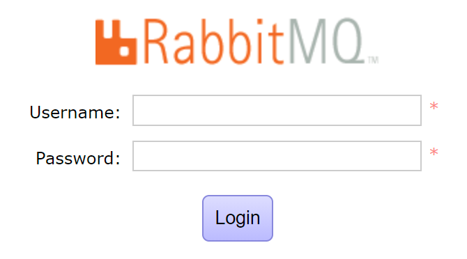
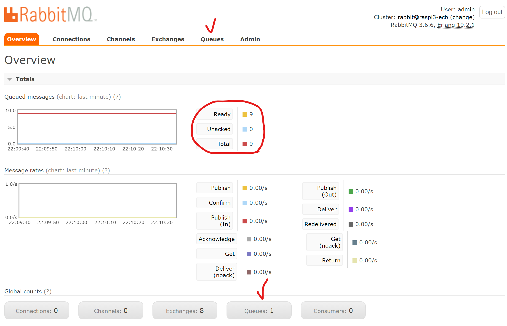
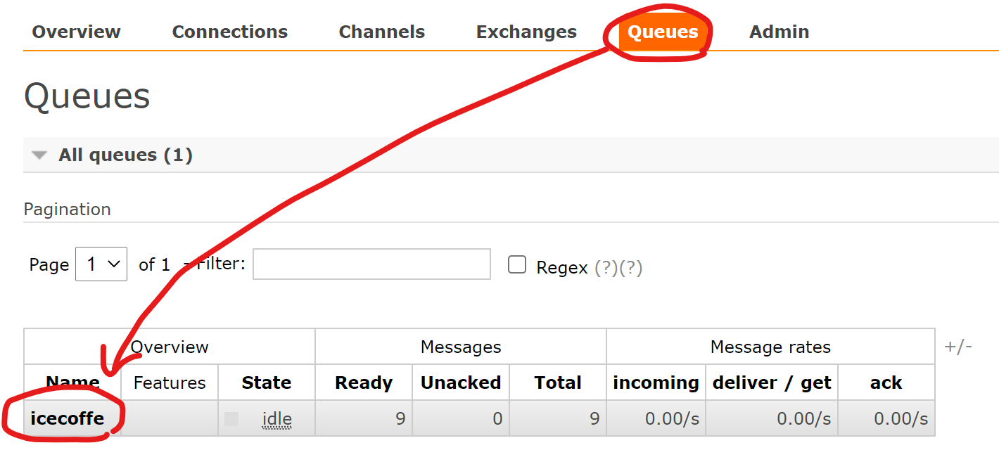

# MQTT-Server

RabbitMQ 서버측 디자인 및 코드에 대해 다룹니다.


## 외부 접속 방법

- 관리페이지 링크 : http://211.179.42.130:15672/
- RabbitMQ ID : rabbit
- RabbitMQ PW : MQ321
- AMQP 통신 Port : 5672 (5671)


### 관리페이지에서 도착한 메세지 조회방법



RabbitMQ에 Username(ID), Password(PW)를 입력하여 로그인하여 관리자 페이지 접속.




위와 같이 메인페이지(Overview)를 볼 수 있으며 이 때 도착하여 있는 메세지는 몇개인지 확인이 가능하며, 상세한 내용은 Queues 탭에서 확인 가능함.




Queues 탭에 들어오면 각  `routing_key` 를 기준으로 메세지들이 나뉘어져있으며, 해당 이름을 클릭하면 상세 페이지로 넘어갈 수 있음.


여러 목록 중 `Get messages` 에서 상세 메세지 내용을 확인할 수 있음.


## 예제코드 (파이썬을 통한 메세지 송신)

파이썬으로 MQTT를 사용하기 위해서는 `python -m pip install pika --upgrade` 명령을 통해 pika 라이브러리를 다운받아 미리 준비해둬야합니다.

```python
  1 import pika
  2
  3 cred = pika.PlainCredentials('admin','1234')
  4 connection = pika.BlockingConnection(pika.ConnectionParameters(host='211.179.42.130',port=5672,credentials=cred)    )
  5
  6 channel = connection.channel()
  7 channel.queue_declare(queue='icecoffe')
  8
  9 channel.basic_publish(exchange='',  routing_key='icecoffe', body='hello webos')
 10
 11 connection.close()
```
  
접속을 위하여 계정의 아이디와 패스워드를 명시해줍니다. `.PlainCredentials('admin','1234')`
> 이 예시에서는 ID가 admin, PW가 1234임을 의미합니다.  
  
이어서 네트워크 정보를 입력해줍니다. `.ConnectionParameters(host='211.179.42.130',port=5672,credentials=cred`
> 이는 IP 211.179.42.130, Port는 기본포트인 5672, 로그인 계정정보는 `cred` 임을 의미합니다.
  
7번째 라인 : 메세지를 발행할 queue를 명시합니다. `.queue_declare(queue='icecoffe')`
> 여기서는 icecoffe queue에 메세지가 발행되며, 만약 해당 queue가 없는 경우 이 구문을 통해 새로 생성합니다.
  
9번째 라인 : 해당 큐에 메세지를 발행합니다. `.basic_publish(exchange='',  routing_key='icecoffe', body='hello webos')`
> 이 경우 icecoffe 라는 queue에 hello webos 라는 메세지가 보내집니다. RabbitMQ는 메세지 전달시 반드시 exchange를 거쳐야하나 공란으로 둘경우 queue를 직접 선택할 수 있습니다.
  


## 참고링크
### RabbitMQ 개념

- RabbitMQ 개념 블로그1  : https://nesoy.github.io/articles/2019-02/RabbitMQ

 - RabbitMQ 개념 블로그2 : https://coding-start.tistory.com/371
 - RabbitMQ 개념 동영상 : https://www.youtube.com/watch?v=deG25y_r6OY

### 설치 및 실사용 관련
 - RabbitMQ 공식사이트 : https://www.rabbitmq.com/
 - 서버 설치설명 : http://pont.ist/rabbit-mq/
 - 서버 설치공식 : https://www.rabbitmq.com/install-debian.html
 - 클라이언트 파이썬예제 한글번역 : https://blog.storyg.co/rabbitmqs/tutorials/python/01-hellowolrd
 - Python으로 메시지 생성, 소비하기 : https://smoh.tistory.com/289
 - RabbitMQ 시행착오 모음 : https://shortstories.gitbooks.io/studybook/content/message_queue_c815_b9ac/rabbitmq-c0bd-c9c8.html
 - 파이썬 pika.connection 인자값 설명 : https://pika.readthedocs.io/en/stable/modules/parameters.html
 - Ubuntu 에서 RabbitMQ 설치하기 : https://jonnung.dev/rabbitmq/2019/01/30/rabbitmq-installation-on-ubuntu/
 - RabbitMQ 설치 및 실행 간단예 : https://yoonwould.tistory.com/157
