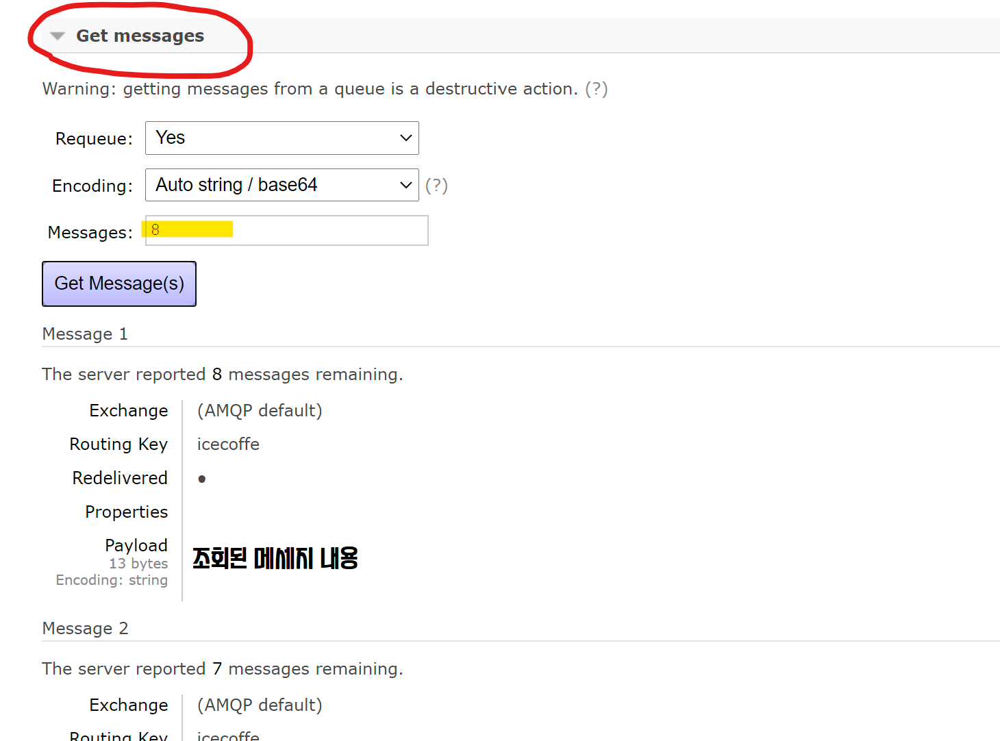

# MQTT Broker Server

RabbitMQ Broker 서버측 디자인 및 코드, 프로토콜 규약 등에 대해 다룹니다.


##  ✅ TODO

### 서버환경 관련

✅ RabbitMQ 서버 개설 및 외부 접속 테스트

✅ 파이썬 예제코드 작성 및 테스트

⬜ MQTT 프로토콜 규약

⬜ 각 Device 별 queue 및 topic 기준 exchange를 추가 진행, 이후 규약에 따른 연결

⬜ QoS 수준지정

### 서버 MQTT-Client 관련

⬜ 안드로이드에서 회원가입시 전달받은 정보를 파이어베이스에 추가하는 코드

⬜ webOS에서 회원가입시 이를 파이어베이스에 추가하는 코드 (이때, Auth.에도 추가해야함?)


# 외부 접속 방법

- 관리페이지 링크 : http://211.179.42.130:15672/
- RabbitMQ ID : rabbit
- RabbitMQ PW : MQ321
- AMQP 통신 Port : 5672 (5671)


### 관리페이지에서 도착한 메세지 조회방법


RabbitMQ에 Username(ID), Password(PW)를 입력하여 로그인하여 관리자 페이지 접속.


위와 같이 메인페이지(Overview)를 볼 수 있으며 이 때 도착하여 있는 메세지는 몇개인지 확인이 가능하며, 상세한 내용은 Queues 탭에서 확인 가능함.


Queues 탭에 들어오면 각  `routing_key` 를 기준으로 메세지들이 나뉘어져있으며, 해당 이름을 클릭하면 상세 페이지로 넘어갈 수 있음.




여러 목록 중 `Get messages` 에서 상세 메세지 내용을 확인할 수 있음.


# 예제코드 (파이썬)

파이썬으로 MQTT를 사용하기 위해서는 `python -m pip install pika --upgrade` 명령을 통해 pika 라이브러리를 다운받아 미리 준비해둬야합니다.


## Queue에 Direct로 메세지 보내기

> ./sample/MessageQueue_sendQ_example.py

```python
  1 import pika
  2
  3 cred = pika.PlainCredentials('rabbit','MQ321')
  4 connection = pika.BlockingConnection(pika.ConnectionParameters(host='211.179.42.130',port=5672,credentials=cred)    )
  5
  6 channel = connection.channel()
  7 channel.queue_declare(queue='icecoffe')
  8
  9 channel.basic_publish(exchange='',  routing_key='icecoffe', body='hello webos')
 10
 11 connection.close()
```

접속을 위하여 계정의 아이디와 패스워드를 명시해줍니다. `.PlainCredentials('admin','1234')`
> 이 예시에서는 ID가 admin, PW가 1234임을 의미합니다.  

이어서 네트워크 정보를 입력해줍니다. `.ConnectionParameters(host='211.179.42.130',port=5672,credentials=cred`
> 이는 IP 211.179.42.130, Port는 기본포트인 5672, 로그인 계정정보는 `cred` 임을 의미합니다.

7번째 라인 : 메세지를 발행할 queue를 명시합니다. `.queue_declare(queue='icecoffe')`
> 여기서는 icecoffe queue에 메세지가 발행되며, 만약 해당 queue가 없는 경우 이 구문을 통해 새로 생성합니다.

9번째 라인 : 해당 큐에 메세지를 발행합니다. `.basic_publish(exchange='',  routing_key='icecoffe', body='hello webos')`
> 이 경우 icecoffe 라는 queue에 hello webos 라는 메세지가 보내집니다. RabbitMQ는 메세지 전달시 반드시 exchange를 거쳐야하나 공란으로 둘경우 queue를 직접 선택할 수 있습니다.


## Queue에 있는 메세지 읽기

> ./sample/MessageQueue_reciveQ_example.py

```python
import pika

cred = pika.PlainCredentials('rabbit','MQ321') #MQTT계정 ID,PW를 차례로 입력
connection = pika.BlockingConnection(pika.ConnectionParameters(host='211.179.42.130',port=5672,credentials=cred)) #MQTT서버의 IP, Port를 입력
channel = connection.channel()

channel.queue_declare(queue='icecoffe') #사용할 queue를 정의 (해당 queue가 없다면 새로 생성)

def callback(ch, method, properties, body):
	print(" [x] Received %r" % body.decode())

channel.basic_consume(queue='icecoffe', on_message_callback=callback, auto_ack=True)

print(' [*] Waiting for messages. To exit press CTRL+C')
channel.start_consuming()
```

전체적인 구성은 메세지를 보내는 것과 동일합니다. 다른점은 `.basic_consume` 함수가 사용되었다는 것입니다. 또한 메세지가 도착했을 경우 사용자가 정의한 `callback` 함수가 사용됩니다. 가장 마지막 줄에 있는 `.start_consuming()` 을 통해 구독한 queue에 대한 지속 확인이 시작됩니다.

> 해당 코드에서는 icecoffe queue에 메세지가 도착할경우 이를 읽어 소비합니다.


## exchange를 통해 메시지 보내기

> ./sample/MessageQueue_sendQ_withExchange.py

```python
#!/usr/bin/env python
import pika
import sys

cred = pika.PlainCredentials('rabbit','MQ321') #MQTT계정 ID,PW를 차례로 입력
connection = pika.BlockingConnection(pika.ConnectionParameters(host='211.179.42.130',port=5672,credentials=cred)) #MQTT서버의 IP, Port를 입력
channel = connection.channel()

# 사용할 exchange 이름과 type(direct, topic, fanout ..)을 입력합니다. 해당 exchange가 없을시 생성합니다.
channel.exchange_declare(exchange='test321', exchange_type='direct')

message = "info: Hello World!"
channel.basic_publish(exchange='test321', routing_key='amqtest', body=message)
print(" [x] Sent %r" % message)
connection.close()
```

기존 Direct-Queue 메세지 송신과의 다른점은 사용할 queue를 지정하는 것이 아닌  exchange를 명시하였다는 것입니다.  `channel.excahnge_declare()`

테스트시에 해당 exchange는 Direct로 설정되어 있었으며 옵션은 아래 그림과 같습니다.


아래쪽 Bindings를 통해 `amqtest` , `icecoffe` , `test321` 에 메세지를 전달해주는 역할을 한다는걸 알 수 있습니다. `amqtest` 의 경우 Routing_key로 amqtest를 명시하였으므로, 해당 KEY의 메세지들은 `amqtest` 큐로 가게됩니다. Routing_key를 명시하지않는 경우 `icecoffe`와 `test321` 로 보내지게 됩니다.  


# Car2Home 프로토콜 정의 (작성중)

메세지 발행시에 필요한 항목들을 아래와 같이 정의합니다.

- exchange
- routing-key
- payload


## exchange

모든 메세지는 반드시 exchange를 통해 발행되어야 하며, exchange의 type은 `topic` 입니다. 사용할 exchange의 정보는 아래와 같이 정의합니다.

### 기본 정보

- Name : webos.topic
- Type : topic
- Durability : Transient
- Auto delete : No
- Internal : No
- Arguments : (none)

### Bindings 규칙

- To `amqtest` , Routing Key `amqtest` , Arguments `none`

### 특이사항

- 이와 별개로 webos.fanout 이라는 exchange를 개설하여 전체 Queue에 긴급 메세지를 전달하는 역할을 수행하게함.


## routing-key

메세지 발행시 사용되는 routing-key는 반드시 사전에 정의된 이름을 따라야하며, 그 항목은 아래와 같습니다.

> webos.DEVICE_NAME.MESSAGE_TYPE
> 예) webos.android.info //android로 보내는 info 메세지

### DEVICE_NAME 종류

- server : 처리서버 (MQTT, openCV, Firebase조회/갱신)
- smarthome : 스마트홈 아두이노 (센서, 가전제어)
- car : 차량 터치패널 (스마트카, 회원가입, UI/UX제어, 각종 데이터 조회)
- android : 안드로이드 어플리케이션 (회원가입, UI/UX제어, 각종 데이터 조회)
- camera : 차량 웹캠측 (사용자 얼굴 스트리밍, 조도센서값에 따른 조명제어)

### MESSAGE_TYPE 종류

- info : 메세지를 통해 보통의 정보를 전달하는 경우
- error : 동작을 정상적으로 처리하지 못하고 치명적인 에러가 발생한 경우
- warning : 동작을 정상적으로 처리하였으나, 이 과정에서 에러가 발생한 경우


## payload

실제 사용되는 데이터는 json 형태로 전송되어야 하며, 사용 항목들은 반드시 사전에 정의되어야 합니다. 아래는 각 기기별 메세지 항목 예시입니다. 또한 모든 메세지의 처음에는 `발행자(producer)`와 `어떠한 정보(information)`인지를 명시해야 합니다.


### Android -> Server : 회원가입

해당은 안드로이드 어플을 통해 정상적으로 회원가입을 진행완료하였을 때, 서버측으로 보내는 메시지입니다.

- Producer : android
- information : signup
- UID : <firebass에서 받아옴>
- name : <사용자 입력>

JSON 예시

```json
{
    "Producer" : "android",
    "command" : "signup",
    "UID" : "eAMHGLmiBGO76PIQ54O9CpsqTb23",
    "name" : "Hong-Gil-Dong"
}
```


# 참고링크

### RabbitMQ 개념
 - RabbitMQ 개념 블로그1  : https://nesoy.github.io/articles/2019-02/RabbitMQ  
 - RabbitMQ 개념 블로그2 : https://coding-start.tistory.com/371  
 - RabbitMQ 개념 동영상 : https://www.youtube.com/watch?v=deG25y_r6OY  
 - exchange 종류 : https://jonnung.dev/rabbitmq/2019/02/06/about-amqp-implementtation-of-rabbitmq/    
 - 구조, 품질, 장애대비 관련참조 : https://jeongchul.tistory.com/296  

### 설치 및 간단사용 관련
 - RabbitMQ 공식사이트 : https://www.rabbitmq.com/
 - 서버 설치설명 : http://pont.ist/rabbit-mq/
 - 서버 설치공식 : https://www.rabbitmq.com/install-debian.html
 - 클라이언트 파이썬예제 한글번역 : https://blog.storyg.co/rabbitmqs/tutorials/python/01-hellowolrd
 - Python으로 메시지 생성, 소비하기 : https://smoh.tistory.com/289
 - RabbitMQ 시행착오 모음 : https://shortstories.gitbooks.io/studybook/content/message_queue_c815_b9ac/rabbitmq-c0bd-c9c8.html
 - 파이썬 pika.connection 인자값 설명 : https://pika.readthedocs.io/en/stable/modules/parameters.html
 - Ubuntu 에서 RabbitMQ 설치하기 : https://jonnung.dev/rabbitmq/2019/01/30/rabbitmq-installation-on-ubuntu/
 - RabbitMQ 설치 및 실행 간단예 : https://yoonwould.tistory.com/157
 -
